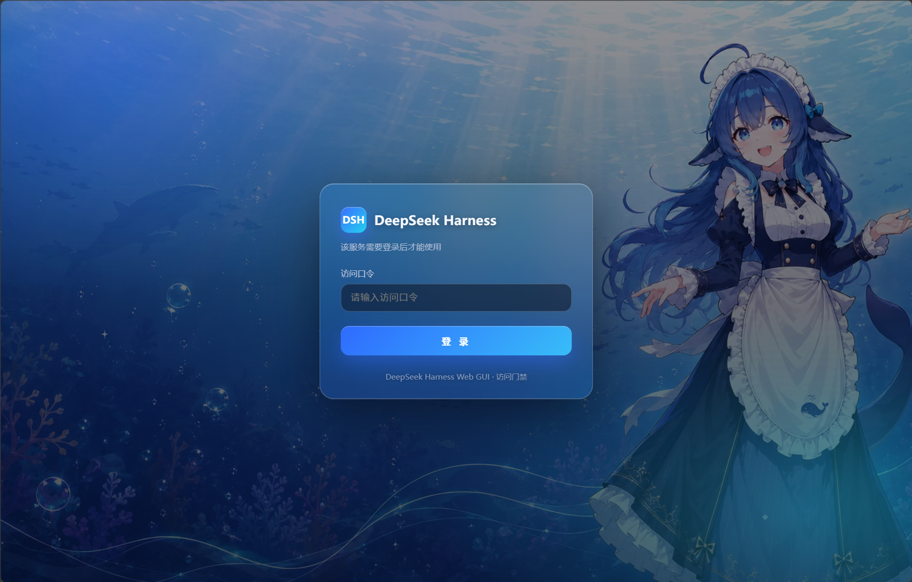

# DSH 我独自升级（dsh-solo-leveling）

> **个人 DeepSeek Harness（DSH）插件集：自研 + 收录。**
> 围绕一个目标：**把 DSH 部署在 Linux 服务器上，然后从浏览器、手机、局域网 / 公网的
> 其他端随时调用**。所有插件源码都在本仓库，clone 后按需安装，无需改源码、无需编译。

## 截图

### 登录门闸（`dsh-AccessGate`）

深蓝海底动漫风背景 + 毛玻璃登录卡片，桌面端与手机端均自适应：

| 桌面端 | 手机端 |
|---|---|
|  |  |

## 插件清单

| 插件 | 作用 |
|---|---|
| **[访问门禁](dsh-AccessGate/)** | 口令登录门闸（首次 `/setup` 设口令、会话 Cookie + 限速）+ HTTPS 反代；dsh 只监听回环、对外走 caddy |
| **[默认值](dsh-Moresettings/)** | 「设置 → 插件 → 插件配置 → 默认值」卡片：默认工作目录 + 默认重试次数（对所有供应商生效） |
| **[桌宠](dsh-deepseekpet/)** | 网页交互式桌宠：随任务 / 工具调用 / 上下文自动切换表情，可拖动缩放折叠（MIT 收录） |
| **[手机端适配](dsh-mobile/)** | 窄屏（≤768px）：聊天区占满全宽、文件树 / 预览变抽屉、输入框 16px 防 iOS 缩放 + 安全区 |
| **[任务套件](dsh-task-suite/)** | 一个聚合包装齐：任务看板（cron 定时跑）、实时令牌 / 吞吐统计、Git 图谱、右侧面板、图像理解、皮肤中心 + 11 款皮肤 |

## 快速安装

前置：已安装 DSH（`dsh` CLI，版本 `0.1.0-rc.6`）。

```bash
git clone https://github.com/zzyyyds88/dsh-solo-leveling.git
cd dsh-solo-leveling
```

按需装单个插件（正式安装会停 / 重启 `dsh web`，**请在 SSH 终端手动执行**；各项目 README 有完整步骤）：

| 插件 | 安装入口 |
|---|---|
| 访问门禁 | `node dsh-AccessGate/install-access-gate-plugin.mjs --allow-formal` |
| 默认值 | `bash dsh-Moresettings/install-to-profile.sh` |
| 手机端适配 | `bash dsh-mobile/install-to-profile.sh` |
| 桌宠 | `node dsh-deepseekpet/install-pet-plugin.mjs --allow-formal` |
| 任务套件 | 见 `dsh-task-suite/README.md` |

## 为什么是源码分发、而不是 npm 包

`dsh-AccessGate`（门闸）和 `dsh-Moresettings`（默认值）依赖一批 **`@deepseek-ai/*` 同包名
覆盖 fork**——webserver 的 `registerGate` 门闸钩子、apiproxy 的命名空间暴露等。这些钩子
**官方上游没有**，而 `@deepseek-ai/*` 这个 npm scope 归 DeepSeek 所有、个人无法发布，
`dsh plugin add` 也只会解析到官方原版（不带这些钩子）。所以这些 fork 必须由安装脚本
直接铺进 profile 的 `node_modules/@deepseek-ai/`（同名覆盖）。

与其让用户「npm 装一半纯插件 + 脚本装一半 fork」两套流程，不如整仓统一走
**GitHub 源码 + 各项目安装脚本**：clone 后跑一个脚本，fork + 纯插件 + 配置一次装齐。
**这就是本仓库不单独发 npm 的原因。**

> 想纯 npm 分发（`dsh plugin add @scope/xxx`）的唯一前提是**上游化**：把上述钩子 PR 进
> deepseek-harness 官方，届时 fork 归零、插件即可纯 npm 分发。

## 文档

- 插件总览（使用 / 更新 / 维护）：[PLUGINS.md](PLUGINS.md)
- 贡献指南（fork 原理 / 测试环境 / 开发规范）：[CONTRIBUTING.md](CONTRIBUTING.md)
- 许可证：[LICENSE](LICENSE)（Apache-2.0；收录的 maid-atelier 为 CC BY-NC-SA 4.0、miku 为 BSD）

## 致谢

- 桌宠：[keleus/deepseek-pet](https://github.com/keleus/deepseek-pet)（MIT）
- 任务套件（上游抽取）：[zhu1090093659/dsh-web-ui](https://github.com/zhu1090093659/dsh-web-ui)（Apache-2.0）
- 皮肤 [maid-atelier](https://github.com/Small-tailqwq/dsh-deep-whale)（CC BY-NC-SA 4.0）
