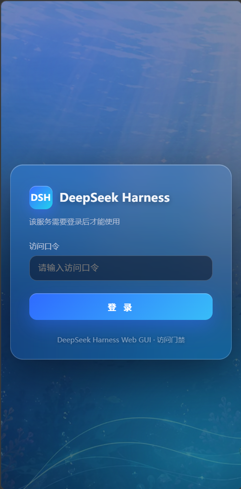

# DSH 我独自升级（dsh-solo-leveling）

> **个人 DSH 插件集：自研 + 收录。**
> 这里存放我自己开发的 DeepSeek Harness（DSH）插件，也收录我挑选的好用插件——
> 它们都围绕同一个目标：**把 DSH 部署在 Linux 服务器上，然后从浏览器、手机、
> 局域网/公网的其他端随时调用**。
>
> 本仓库已包含全部插件源码（`dsh-AccessGate/`、`dsh-Moresettings/`、
> `dsh-deepseekpet/`、`dsh-mobile/`、`dsh-task-suite/`）与规范文档；
> 插件总览见 [PLUGINS.md](PLUGINS.md)。

## 截图

### 登录门闸（`dsh-AccessGate`）

深蓝海底动漫风背景 + 毛玻璃登录卡片，桌面端与手机端均自适应：

| 桌面端 | 手机端 |
|---|---|
|  |  |

<!-- 待补：访问门禁/默认值设置卡片（02/03）、桌宠（04）、任务看板（05）—— 图片放 docs/screenshots/ 后取消注释：
| 访问门禁卡片 | 默认值卡片 | 桌宠 | 任务看板 |
|---|---|---|---|
|  |  |  |  |
-->

## 快速安装

前置：已安装 DSH（`dsh` CLI，版本 `0.1.0-rc.6`），DSH_HOME 为 `$HOME/.dsh`。

```bash
git clone https://github.com/zzyyyds88/dsh-solo-leveling.git
cd dsh-solo-leveling
```

按需装单个插件（正式安装脚本会停/重启 `dsh web`，**请在 SSH 终端手动执行**；
每个项目 README 有完整步骤与验证方法）：

| 插件 | 安装入口 |
|---|---|
| 访问门禁（登录门闸 + HTTPS） | `node dsh-AccessGate/install-access-gate-plugin.mjs --allow-formal` |
| 默认值（工作目录 / 重试） | `bash dsh-Moresettings/install-to-profile.sh` |
| 手机端适配 | `bash dsh-mobile/install-to-profile.sh` |
| 桌宠 | `node dsh-deepseekpet/install-pet-plugin.mjs --allow-formal` |
| 任务套件（看板 / 统计 / 皮肤…） | 见 `dsh-task-suite/README.md` |

> 纯插件（mobile / pet / task-suite）本质都是官方 `dsh plugin add`；access-gate 与
> defaults 还会额外铺一层 fork（见下「分发方式」）。安装与验证细节见
> [PLUGINS.md](PLUGINS.md) §2。

**规矩文件（开工前必读）**：人类贡献指南 [CONTRIBUTING.md](CONTRIBUTING.md) ·
AI 代理强制红线 [AGENTS.md](AGENTS.md) · 开发规范 [docs/开发规范.md](docs/开发规范.md)
（上游原文存档 [docs/上游开发规范/](docs/上游开发规范/)）。工作区已纳入
**git 版本控制**（默认分支 `main`），发布到 GitHub 的流程见 CONTRIBUTING.md 第 10 节。

**铁律（最高优先级）**：打包测试 / 安装 / 升级，**禁止在已经运行中的正式 DSH
（端口 3080）强行替换**（会把正在运行的 DSH 换掉导致崩溃）——必须先在工作区级
专用测试环境 `test-envs/test-env-1/`（独立 DSH_HOME + 端口 3090）测试通过，之后才允许安装。
---

## 分发方式：为什么走 GitHub 源码、不发 npm 包

本仓库插件分两类：

| 类型 | 插件 | 能否发 npm |
|---|---|---|
| 纯插件（标准 bundle） | `dsh-mobile-adapt`、`deepseek-pet`、`dsh-task-suite` 全家 | ✅ 能 |
| 依赖 fork 的插件 | `dsh-AccessGate`、`dsh-Moresettings` | ❌ 不能 |

`dsh-AccessGate`（登录门闸）和 `dsh-Moresettings`（默认值）依赖一批 **`@deepseek-ai/*` 同包名
覆盖 fork**——webserver 的 `registerGate` 门闸钩子、apiproxy 的命名空间暴露、connection 的
登录放行、目录选择器默认路径、llm 重试默认值等。这些钩子**官方上游并没有**，而且：

- `@deepseek-ai/*` 这个 npm scope 归 DeepSeek 所有、个人无法发布（这些 fork 还声明了 `private: true`）；
- 即便换个 scope 发上去，`dsh plugin add` 也只会按 `@deepseek-ai/*` 名字解析到**官方原版**
  （不带这些钩子），fork 依然装不进去。

所以 access-gate / defaults 的 fork 必须由安装脚本直接铺进 profile 的
`node_modules/@deepseek-ai/`（同名覆盖，这是 [AGENTS.md](AGENTS.md) 红线 7 里的
「唯一显式例外」）。与其让用户「npm 装一半纯插件 + 脚本装一半 fork」两套流程，不如
整仓统一走 **GitHub 源码 + 各项目自带安装脚本**：clone 后跑一个脚本，fork + 纯插件 +
配置一次装齐。**这就是本仓库不单独发 npm 的原因。**

> 想让它们也能 `dsh plugin add @scope/xxx` 纯 npm 装，唯一前提是**上游化**：把上述钩子
> PR 进 deepseek-harness 官方，届时 fork 归零、插件即可纯 npm 分发。当前未合入前维持源码分发。

---

## 1. 这是什么地方

负责的典型工作：

- **Web GUI**（`dsh web`，默认 http://127.0.0.1:3080）交互优化；
- **CLI / 工作区 / 会话**等使用体验改进；
- 对 DSH 安装包做本地定制补丁，并配套「升级后恢复」方案。

**工作区根目录只允许出现**：`README.md`、`CONTRIBUTING.md`、`AGENTS.md`、
`scripts/`（共享工具）、`test-envs/`（专用测试环境）、`docs/`（开发规范与
上游存档）和项目子文件夹，所有具体内容必须进各自项目文件夹。

## 2. 目录约定（铁律）

> **每一个单独的项目，单独占一个子文件夹。** 不混放、不散落。

```
DSH我独自升级/
├── README.md                    ← 本说明（工作区用途 + 流程）
├── CONTRIBUTING.md              ← 贡献规矩（人类 + AI 通用，含发布到 GitHub）
├── AGENTS.md                    ← AI 代理强制红线
├── scripts/                     ← 共享工具：测试环境管理（test-env-*.sh）、上游文档抓取
├── test-envs/                    ← 工作区级专用 DSH 测试环境（test-env-1~4，端口 3090~3093）
├── docs/                        ← 开发规范（开发规范.md）+ 上游原文存档（上游开发规范/）
└── <项目名>/                    ← 一个项目一个文件夹
    ├── README.md                ← 思路库：问题、原理链路、方案、备选思路
    ├── <工具脚本>               ← 幂等补丁/工具脚本（如 patch-xxx.py）
    ├── verify.sh                ← 验证脚本
    ├── 升级后重打补丁指南.md      ← DSH 升级导致补丁失效后的恢复指引
    └── <项目名>定制记录/          ← 本次实际改动的详细记录
        ├── README.md            ← 记录文件夹说明 + 快速回顾
        ├── 变更记录.md           ← 做了什么、为什么、怎么验证、怎么回退
        └── 本次diff.patch       ← 机器可读的改动 diff
```

## 3. 标准工作流程

1. **建文件夹**：`mkdir <项目名>`，先写项目 `README.md` 的思路库骨架。
2. **分析链路**：先搞清楚改动点在整条链路中的位置（前端插件 bundle / 后端 RPC / profile 配置），
   记录原理图，列出所有候选改法。
3. **选改动点**：优先选**改完浏览器刷新即可生效**的方案（前端 bundle 实时读盘 + `no-cache`），
   避免需要重启 `dsh web` 的方案（会中断 GUI 和会话）。
4. **实施**：动手前确认目标文件位置与版本；改动后先做**语法/格式校验**（如 `node --check`）。
5. **测试环境验证（必经）**：构建产物装进工作区级测试环境
   （`scripts/test-env-install.sh`），启动测试实例（`scripts/test-env-start.sh`，
   端口 3090）实测；正式实例（3080）不做任何实验。验证脚本 + 实测结果
   逐条记录到 `变更记录.md`。
6. **留备份**：被改的安装包文件旁留 `.bak` 备份，回退方法写进记录。
7. **写恢复方案**：补丁脚本做成**幂等**（重复执行安全），并写 `升级后重打补丁指南.md`。
8. **正式安装（仅用户）**：生成 `本次diff.patch`，更新项目 README 与根 README 的项目清单；
   会停/重启 dsh web 的正式安装脚本，交给用户在 SSH 终端手动执行。

## 4. 关键经验（从已有项目中沉淀）
https://deepseek-harness.github.io/deepseek-harness/develop/basic/  需要以此为基础进行开发
- **DSH 升级/重装会覆盖安装包**，所有直接改包内文件的补丁都会失效 → 必须配幂等重打脚本。
- 服务端对 `/plugins/<id>/client.js` 的响应是**每请求实时读盘、`cache-control: no-cache`**，
  改完文件浏览器刷新即生效，无需重启、不打断会话。
- 后端插件（`dsh-host-*`）改动**需要重启 `dsh web`**，风险更高，一般不优先选。
- 长期更稳的方向：**profile 配置化插件**（`/root/.dsh/profiles/web/cordis.patch.yml` 挂载自定义插件，
  不碰安装包，升级天然免疫）或**上游化**（给 deepseek-harness 提 issue/PR）。
- **⚠ 运行中的 `dsh web` 会热重载 `cordis.patch.yml` 的改动**：在服务存活时改写该文件，
  会触发配置热重载、把承载 Web/agent 会话的进程搞崩（表现为工具调用莫名中断/任务失败）。
  → 所有 profile 配置改动必须**原子化**：先停服务 → 写配置 → 再启动（如 `switch-to-https.sh`）。
- **⚠ agent 绝不能自己重启 `dsh web`**：agent 就运行在 dsh web 进程里，一旦 pkill/重启，
  执行中的工具调用会被中断（等于自杀）。凡需重启 dsh 的操作（停→改→起）一律封装成
  脚本（如 `switch-to-https.sh`），交给用户在 SSH 终端执行。
- **端口不要硬编码进 dsh 侧配置**：trustedHosts 固化用**无端口 host**（任意端口放行），
  改端口只动反代（Caddyfile + `systemctl restart caddy`），与 dsh 解耦。
- **同一端口无法同时收 HTTP 与 HTTPS**（caddy/nginx 通性）：「http 自动跳 https」只能另开端口，
  但用户明确**不要额外 http 跳转入口**——HTTPS 服务直接使用 https:// 前缀，勿自作主张加跳转端口。
- **局域网访问优先整体上 HTTPS，不要逐个打 polyfill**：明文 HTTP 是非安全上下文，
  `crypto.randomUUID` 等浏览器 API 不可用；这类问题用 caddy/nginx 反代 + 自签证书
  （caddy `tls internal`）+ `--trusted-host` 一次解决，而非逐个补丁。
- **动手前先搜现成方案**：GitHub/npm/社区（awesome-deepseek-harness、上游 issue/讨论）里
  dsh-lan-access / dsh-web-auth / dsh-lan-gate / dsh-remote-access-web 等已存在，
  先调研再决定自研还是复用。
- **⚠ 打包测试必须有专用测试环境**：测试实例用独立 `DSH_HOME`（`test-envs/`）
  + 独立端口（**3090**），与正式实例（**3080**）完全隔离；测试实例由
  `scripts/test-env-*.sh` 管理（PID 文件精确启停，禁止 pkill -f 模糊匹配）。
- **用户偏好（本次明确）**：首次启动**绝不自动生成/打印任何随机口令**，只提示用户自己设置；
  按钮少而精（不要多余的清除/兜底按钮）。
- **插件配置入口规范**：一律用「设置 → 插件 → 插件配置」区独立卡片
  （`settings.plugin.item`，样式同官方「网页搜索」卡片），禁止独立标签页
  （见 [docs/开发规范.md §2.5](docs/开发规范.md)）。
- **⚠ 客户端 bundle 里绝不能用 classList 操作 React 管理的 className**：
  React 会重写 className，与 MutationObserver 形成死循环，实测直接把
  renderer 搞崩（页面无声关闭、无报错）。改 DOM 标记一律用 `data-*`
  属性（见 `dsh-mobile/` 踩坑记录）。
- 当前安装：`/usr/lib/node_modules/@deepseek-ai/dsh`，版本 `0.1.0-rc.6`（升级后需更新此处）。

## 5. 项目清单

> 插件总览（正在使用 / 使用方法 / 更新情况 / 维护）见 **[PLUGINS.md](PLUGINS.md)**。
> 个人发布插件到 npm 见 [docs/发布npm插件.md](docs/发布npm插件.md)。

| 项目 | 一句话说明 | 状态 |
|---|---|---|
| ~~修改默认工作目录~~ | Web GUI 目录选择器默认打开 `/home/user/Projects`（替代 `/root`） | **已由 `dsh-Moresettings/` 统一插件替代**，原文件夹已删除 |
| ~~思考强度与重试默认值~~ | 第三方模型可在对话框直接调思考强度（默认 off/low/medium/high，可精确声明）；默认重试次数 2→5 | **已由 `dsh-Moresettings/` 统一插件替代**（思考强度保持内建默认、重试次数设置页全局生效），原文件夹已删除 |
| `dsh-AccessGate/` | **登录鉴权正式插件**（原「全网监听与登录鉴权」插件化改造）：caddy HTTPS 反代（`https://<IP>:5700`）+ 口令登录门闸（首次 `/setup` 设口令、设置 → 插件 → 插件配置「访问口令」卡片、会话 Cookie + 限速）；dsh 仅监听回环；**升级免疫**（依赖 fork + profile 插件，不再打安装包补丁） | 正式已部署（3080 + 5700，口令 `<已脱敏>`）；旧版项目（全网监听与登录鉴权/）已清理 |
| ~~定制插件化改造~~ | 原「母工程」：把三个补丁项目改造成**源码构建 + profile 挂载的正式插件**（同包名覆盖：webserver 门闸 / apiproxy 命名空间 / connection 放行 / 目录选择器默认路径 / pi-ai 思考强度 + retryPolicy 配置化），升级免疫 | **已解散**：8 个 fork 源码归位到 `dsh-AccessGate/packages/`（webserver / apiproxy / connection）与 `dsh-Moresettings/packages/`（picker / llm / llm-deepseek / pi-ai / client-picker），安装脚本各自独立构建，原文件夹已删除 |
| `dsh-Moresettings/` | **统一默认值插件**（合并「修改默认工作目录」+「思考强度与重试默认值」，即原 `dsh-defaults`）：设置 → 插件 → 插件配置 →「默认值」卡片配置默认工作目录与默认重试次数（**对所有供应商生效**，含内置 DeepSeek），改设置即时生效无需重启 | 源码即产物 + 五个 fork（全部在本项目 `packages/` 内，自包含）；test-env 验证通过（`verify-defaults.mjs` 9 项断言）；正式安装待用户执行 `install-to-profile.sh` |
| `dsh-deepseekpet/` | **收录上游桌宠插件**（[keleus/deepseek-pet](https://github.com/keleus/deepseek-pet)，MIT，零改动）：嵌入网页的交互式桌宠，随任务/工具调用/上下文/活跃会话自动切换表情，支持拖动缩放折叠与批准/提问气泡 | test-env-2（3091）验证通过（boot 清单 + client bundle 可加载）；正式安装待用户执行 `dsh plugin --profile web add` |
| `dsh-task-suite/` | **精选 Web UI 插件集（自 [dsh-web-ui](https://github.com/zhu1090093659/dsh-web-ui) v0.1.17 抽取，scope 改 `@zzyyyds88`，一个聚合插件 `dsh-task-suite-all` 装齐）**：任务看板（cron 定时跑）、实时令牌/吞吐统计、Git 图谱、右侧面板（预览 + 文件/变更）、图像理解（describe_image 工具 + 配置卡）、设置中心、皮肤中心 + 11 款皮肤（含收录的 [maid-atelier](https://github.com/Small-tailqwq/dsh-deep-whale)，CC BY-NC-SA 4.0） | 构建 + 全量测试通过（830+ 断言）；test-env 验证通过（boot 全插件 + 皮肤热切换闭环）；正式安装待用户执行 |
| `dsh-mobile/` | **手机端适配插件**（`dsh-mobile-adapt` v0.2.0）：窄屏（≤768px）聊天区占满全宽、aionui 文件树/预览变右侧抽屉（默认收起 + 用户可开）、设置面板字段纵向堆叠消除竖排坏字、输入框 16px 防 iOS 缩放 + 安全区、桌宠缩小/弹层让位；**小改原则**（全部限定窄屏媒体查询，不动皮肤变量与桌面布局） | test-env-1（3090）验证通过（390×844 实测 + 识图复核 + `verify.sh --live` 全绿）；正式旧版已部署，**v0.2.0 待用户执行 `dsh-mobile/install-to-profile.sh`** |
| `test-envs/` | **工作区级专用 DSH 测试环境**：四个环境（`test-env-1~4`，端口 3090~3093），统一收纳于 `test-envs/`，打包测试唯一去处（脚本：`scripts/test-env-*.sh`） | 已部署（基线从正式 profile 克隆；独占使用 + 验收后清理纪律） |
