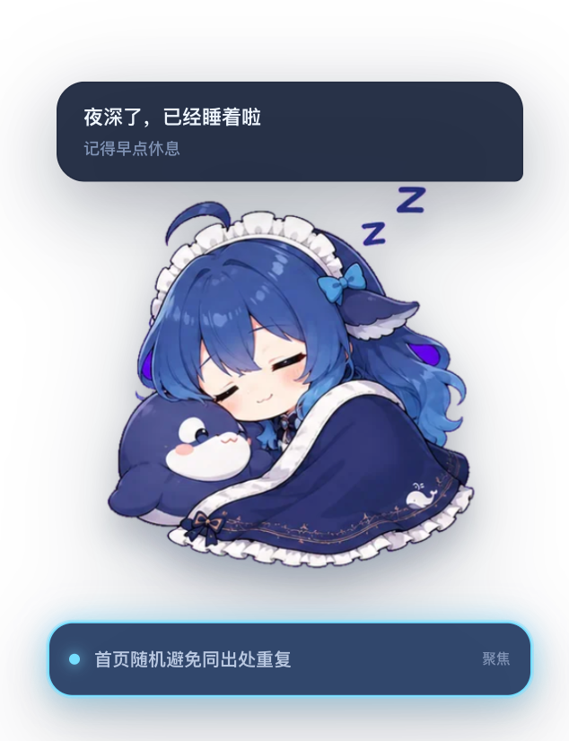

# DeepSeek Pet 插件

DeepSeek Pet 是一个嵌入 DeepSeek Harness 网页的交互式桌宠插件。它会跟随当前任务、
工具调用、上下文占用和活跃会话自动切换 DeepSeek 表情，并通过呼吸、弹跳、倾斜、
视差和淡入动画呈现 Live2D 风格效果。

角色使用完整表情图切换，不拆分头部、手脚或五官图层，避免部件错位和表情突变。



## 功能

- 角色上方用与 Pet 等宽的气泡轮播状态短句，并以单行横向打字机效果跟随最新输出；无任务活动时 10 秒后自动隐藏；
- 角色下方用横条显示聚焦会话并以亮边标记，正在执行的会话向下排列，超过三个时自动层叠收起；
- 多个会话并行执行时进入“忙疯了”状态；
- 根据分析、回答、编码、网络搜索、子 Agent、完成和失败等场景切换表情；回答阶段轮换敲电脑、思考和认真核对等工作形象，思考阶段轮换不同状态标签；
- 工具等待批准时，可直接在气泡中允许或拒绝；
- 用户问题支持选项、自定义输入、提交和拒绝；
- reasoning 中疑问较多时显示困惑或压力表情；
- 用户指出回答有误时显示道歉表情；
- 上下文达到 62% 时提示“还可以再吃一点”，达到 82% 时显示“吃饱了”；
- 图片输入时显示蒙眼状态；
- 无任务 10 分钟显示饿了，30 分钟抱枕犯困，1 小时后睡觉；
- 根据本地时间显示早上、中午、下午和晚上的问候，23 点后犯困，凌晨进入睡觉状态；
- 鼠标移入角色时，在角色脚下显示“−”最小化按钮；
- 支持拖动角色、单击互动、双击折叠；鼠标悬停角色时可用滚轮缩放，并记住位置和尺寸；
- 支持窄屏布局和 `prefers-reduced-motion`。

## 安装

安装需要 Node.js 和 `pnpm`。如果已经全局安装 `dsh`，运行：

```bash
dsh plugin --profile web add github:keleus/deepseek-pet
```

没有全局 `dsh` 命令时，无需额外安装 CLI，直接通过 `npx` 执行：

```bash
npx @deepseek-ai/dsh plugin --profile web add github:keleus/deepseek-pet
```

两种命令效果相同，都会从 GitHub 拉取插件并安装到 Web profile。

安装完成后启动或重新启动网页。全局 CLI：

```bash
dsh web
```

`npx`：

```bash
npx @deepseek-ai/dsh web
```

如果网页已经打开，请刷新页面。

### 拉取源码后安装

```bash
git clone https://github.com/keleus/deepseek-pet.git
cd deepseek-pet
npm install
npm run build
dsh plugin --profile web add .
```

如果没有全局 CLI，将最后一条命令替换为：

```bash
npx @deepseek-ai/dsh plugin --profile web add .
```

本地安装会链接当前目录，修改代码并重新构建后即可继续调试。

## 更新

重新执行安装命令即可拉取并安装远端最新版本：

```bash
dsh plugin --profile web add github:keleus/deepseek-pet
```

或者：

```bash
npx @deepseek-ai/dsh plugin --profile web add github:keleus/deepseek-pet
```

随后重新启动网页进程并刷新页面。

## 卸载

```bash
dsh plugin --profile web remove deepseek-pet
```

没有全局 CLI 时：

```bash
npx @deepseek-ai/dsh plugin --profile web remove deepseek-pet
```

## 使用

- 拖动角色：调整显示位置；
- 鼠标停在角色上滚动滚轮：在 65%～140% 范围内调整 Pet 尺寸；
- 单击角色：触发与当前状态相符的短句反馈；
- 双击角色或点击“−”按钮：最小化为右下角静止图标；
- 点击活跃会话：将该会话切换为聚焦会话；
- 出现批准或提问卡片时：可直接选择、输入、允许或拒绝。

## 开发

环境要求：Node.js 22.19 或更高版本，以及 Python 3 和 Pillow。

```bash
npm install
npm run build
npm test
```

- `npm run assets`：从源图生成透明 WebP 表情并嵌入客户端代码；
- `npm run build`：生成 `lib/index.js` 和 `lib/client.js`；
- `npm test`：运行状态映射、交互和插件装载测试。

主要目录：

```text
src/host/         插件 Host 入口
src/client/       网页入口、组件、状态逻辑和动画样式
public/assets/    表情源素材
scripts/          素材处理和构建脚本
tests/unit/       自动化单元测试
tests/visual/     可按需构建的视觉测试夹具
lib/              可安装的构建产物
```

## 许可证

[MIT](./LICENSE) © 2026 [keleus](mailto:jen.hs@outlook.com)
