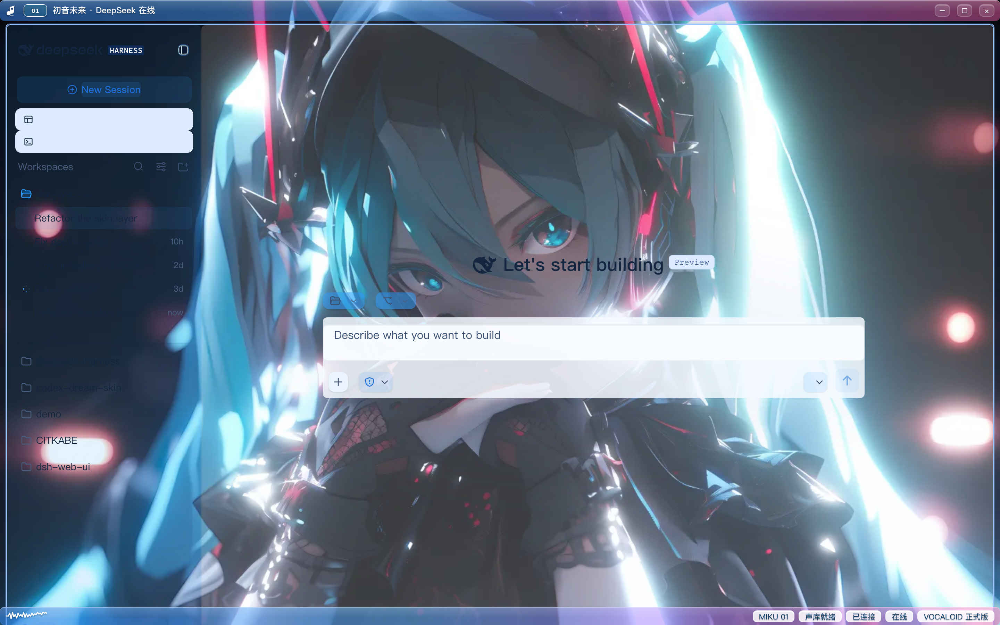
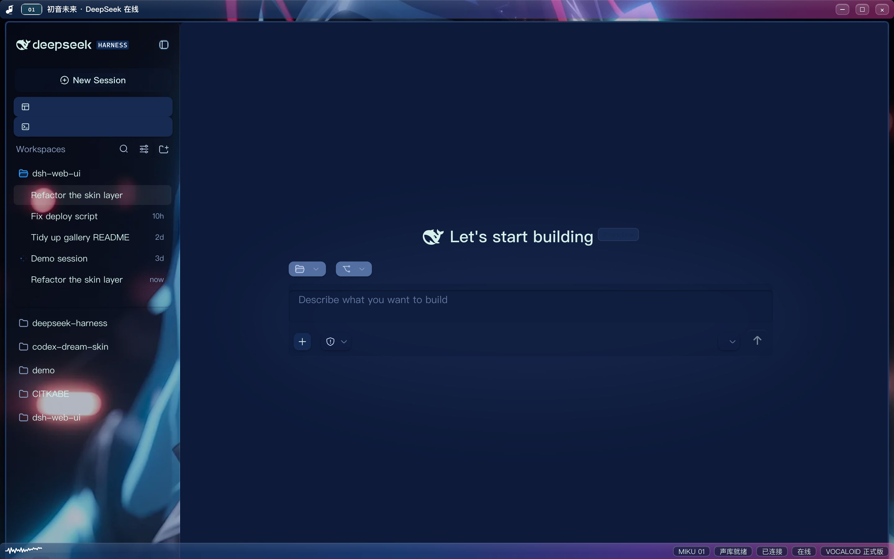

# dsh-client-ui-skin-miku · Hatsune Miku theme skin

English | [中文](README.zh.md)

A Hatsune Miku (初音未来) theme skin for the DeepSeek Harness (DSH) Web GUI.

- **Palette**: a blue-violet-magenta gradient (#2e9bff → #9b5dff → #ff4da6) across the title bar and buttons
- **Frosted glass**: translucent panels, sidebar, input field, settings dialog; the background shows through
- **Custom backdrop**: a built-in sample background that you can replace with your own Miku image
- **Light/dark dual themes**: light is a blue-pink clear sky, dark is a neon blue-violet night
- **Electronic idol elements**: the 01 number badge at the top, a music-note icon, and a music waveform in the status bar

 · 

## Features

- Pure presentation layer: no services injected, no events emitted, no model requests touched
- `apply()` only writes what it withdraws; the disposer fully recovers (body attribute, injected elements, favicon, title)
- All styles hang under `body[data-dsh-miku]` (dark variant `[data-ds-dark-theme]`)
- No static asset files: the background is embedded as a data URI
- `prefers-reduced-transparency` support: users who enable "Reduce Transparency" (macOS / iOS Safari) get the same translucent fills without the GPU blur cost

## Requirements

- Node.js ≥ 20
- pnpm ≥ 9
- A DSH environment running `dsh web` (default `http://127.0.0.1:3080`)

## Build and test

```bash
pnpm install     # install dependencies (runs the prepare build automatically)
pnpm build       # builds lib/index.js + lib/client.js
pnpm test        # apply/dispose contract test
```

The built `lib/` is committed with the repo, so you can install even after cloning without building; a full build is still recommended.

## Install into DSH

```bash
dsh plugin --profile web add "link:<absolute path to this repo>"
```

- Spaces in the path (Windows): `dsh plugin add` breaks arguments containing spaces; use this instead:

  ```bash
  cd ~/.dsh/profiles/web
  pnpm add "link:<absolute path to this repo>"
  ```

  Then append `@zzyyyds88/dsh-client-ui-skin-miku` to the `dsh.profile.bundles` array in `~/.dsh/profiles/web/package.json`.

- After installing, restart `dsh web` and hard-refresh the page (Ctrl+Shift+R).

## Switch skins

Skin activation is mutually exclusive and managed via `scripts/dsh-skin` (writes into the managed section of `~/.dsh/cordis.patch.yml` + the profile symlink):

```bash
dsh-skin use miku       # activate this skin
dsh-skin use official   # restore the official default look
dsh-skin list           # list skins and the currently active one
```

After switching, the config watcher hot-reloads within seconds; refresh the page to apply.

## Custom backdrop

The background lives in the `MIKU_ART` constant of `src/client/art.ts` (a data URI).

To replace it, drop an image you like into this repo (e.g. `bg.png`), then run:

```bash
node scripts/embed-bg.mjs  # converts bg.png to WebP and writes it into art.ts (if the script is absent, convert to base64 manually)
```

Or convert the image to base64 with any tool and replace the `MIKU_ART` value:

```ts
export const MIKU_ART = 'data:image/webp;base64,<...>'
```

Rebuild and refresh the page.

## Configuration

Optional overrides, read from `localStorage` (all are optional; absent or invalid values fall back to the defaults). They are pure presentation — no services, no events:

| Key | Value | Effect |
| --- | --- | --- |
| `dsh.miku.title` | any string | Replaces the pinned title ("初音未来 · DeepSeek 在线") in the title bar and document title |
| `dsh.miku.cells` | JSON array of strings | Replaces the status-bar cells, e.g. `["LIVE 01", "TURBO"]` |

Example:

```js
localStorage.setItem('dsh.miku.title', 'Miku Works')
localStorage.setItem('dsh.miku.cells', JSON.stringify(['LIVE 01', 'TURBO']))
location.reload()
```

## License

BSD-3-Clause
